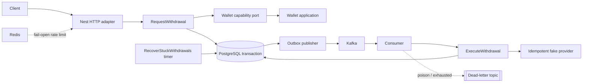

# Architecture

## Shape

The service is a modular monolith with three Nx libraries and one NestJS composition root. Wallet and Withdrawal are explicit domain boundaries in separate packages, but remain deployed together and use one PostgreSQL database so the request flow retains an ACID boundary.

Dependency direction is:

```text
domain <- application ports <- adapters <- Nest wiring
```

Withdrawal owns the consumer-facing `WalletReservationPort` and `WalletSettlementPort`. The composition root adapts those narrow capabilities to Wallet application services. Withdrawal never imports Wallet repositories or aggregate internals.

The Nest container mirrors those boundaries rather than flattening them. Each
context ships its own module behind a `./nest` subpath export and wires its own
use cases; the application chooses adapters and supplies them downward:

```text
AppModule                        controller, exception filter, rate-limit guard, correlation middleware
  ConfigModule                   the one validated AppConfig
  PlatformModule                 the system Clock (@Global — one clock, not convenience)
  WithdrawalContextModule        calls WithdrawalModule.forRoot exactly once, re-exports the result
    WithdrawalModule             withdrawal use cases, built from the tokens it declares
      WithdrawalAdaptersModule   binds withdrawal ports to PostgreSQL, Kafka and the fake provider
        WalletModule             wallet use cases; repositories stay private
          WalletAdaptersModule   binds WALLET_REPOSITORY and WALLET_RESERVATION_REPOSITORY to PostgreSQL
      PersistenceModule          the pool, TRANSACTION_RUNNER and TRANSACTIONAL_CLIENT
  RedisModule                    connection and the fail-open rate limiter
  MessagingModule                outbox publisher, consumer, dead-letter sink, recovery worker
```

`WalletModule` exports its two use cases — `RESERVE_FUNDS` and
`SETTLE_RESERVATION` — and keeps its repositories private, so no other module
can reach a wallet aggregate directly. `WithdrawalAdaptersModule` is where the
two contexts meet: it adapts those use cases to Withdrawal's own
`WALLET_RESERVATION` and `WALLET_SETTLEMENT` tokens. Neither library imports the
other. The boundary is enforced by the container as well as by the lint rule.

Ports stay plain TypeScript interfaces. DI keys are branded symbol tokens that
remember what they resolve to, wired with `provide(target, deps, factory)`,
which type-checks the factory's parameters against its dependency list —
`useFactory` survives in four places where Nest's own shape is required. See
`DECISIONS.md` §40 and §41 for why the contexts own their composition and what
the previous `apps/api/src/composition/` arrangement cost.

Layout on disk:

```text
libs/{wallet,withdrawal}/src/domain              aggregates, value objects, domain events
libs/{wallet,withdrawal}/src/application/ports   one port per file
libs/{wallet,withdrawal}/src/application/<slice> one folder per use case
libs/withdrawal/src/contracts                    the published integration event
libs/{platform,wallet,withdrawal}/src/nest       DI wiring -- the only NestJS imports

apps/api/src/http            controller, DTOs, exception filter, rate-limit guard
apps/api/src/config          one zod-validated AppConfig
apps/api/src/modules         adapter bindings for the contexts' tokens
apps/api/src/observability   correlation-id context and middleware
apps/api/src/adapters/{shared,wallet,withdrawal,messaging,jobs,redis,database}
```

Adapters are grouped by the context that owns them, so `adapters/wallet` holds
exactly what `WalletAdaptersModule` binds.

Each library ships its own Nest module behind a `./nest` subpath export, so a
context owns its composition. `@nestjs/common` appears only under `src/nest/`:
the domain and application layers import no framework.



## Transaction boundaries

`PostgresTransactionRunner` binds one `pg` client to an `AsyncLocalStorage` scope. Application code only sees `TransactionRunner`; adapters take a `TransactionalClient`, obtain the active client through it, and throw `MissingTransactionError` when mutation is attempted without one. The runner is published under both tokens — two views of one instance, neither of them the concrete class. A nested `run` joins the active transaction rather than opening a second one, which is what makes wallet operations participants.

Every transaction **opened through `PostgresTransactionRunner`** sets a transaction-local `lock_timeout` (3s) and `statement_timeout` (10s). The HTTP path, outbox publisher, recovery worker and read model share one bounded pool, so an unbounded lock wait on a contended wallet or idempotency row would starve event delivery.

Two paths do not go through the runner and therefore carry no limits: the outbox publisher's own `BEGIN`/`COMMIT` when it leases a batch, and the schema migrator. The publisher's claim is `FOR UPDATE SKIP LOCKED`, which never waits, and the migrator runs before the application accepts traffic — so neither can produce the unbounded wait the limits exist to prevent. This paragraph previously said *every* transaction, which was not true of either.

Request transaction:

1. Claim `(operation, idempotency_key)`.
2. Lock Wallet with `SELECT ... FOR UPDATE`.
3. Mutate Wallet reserved balance and insert an independent `WalletReservation` aggregate.
4. Insert Withdrawal.
5. Insert Outbox event.
6. Store the canonical response and commit.

Execution uses three phases: a short claim/PROCESSING transaction, the provider call outside PostgreSQL, and a short settlement transaction. The final transaction locks Withdrawal, then the independent WalletReservation and Wallet rows, transitions both aggregates, and records the processed Kafka event atomically.

## Schema management

Migrations are applied by the application at startup, not by the Postgres
entrypoint. Entrypoint scripts run only once, on an empty data directory, so any
environment created before a migration existed would keep an old schema
indefinitely and fail at runtime on the first query needing the new column.

`SchemaMigrator` takes a Postgres advisory lock, creates `schema_migrations` if
needed, and applies each unrecorded file in filename order, one transaction per
file. Replicas booting together serialise on the lock. The migrations ship in the
image alongside the bundle.

## Messaging and Redis

Outbox publishers lease rows using `FOR UPDATE SKIP LOCKED` and a 30-second lease. A crash after Kafka acknowledgement but before `published_at` creates a duplicate message; consumer idempotency is therefore mandatory.

The consumer classifies failures. Unparseable messages and failures that cannot become successes (missing withdrawal, illegal transition) are dead-lettered to `<topic>.dlq` immediately; anything else is retried up to five times with backoff and then dead-lettered. The offset always advances, so one bad record cannot park a partition behind it.

Dead-lettering unblocks delivery but does not abandon the money: `RecoverStuckWithdrawals` scans for withdrawals left `PROCESSING` beyond a timeout and re-publishes execution intent with a fresh event id. Re-execution is safe because settlement refuses terminal withdrawals and the provider is idempotent on `withdrawalId`.

Redis limits requests to 10 per user per minute. The adapter fails open. PostgreSQL remains the only authority for money and durable idempotency.

## Observability

Every infrastructure failure is logged with an `errorCode` and a message read
through `errorCode`/`errorMessage`, which fall back to a driver code rather than
to the literal string `"error"` that `(error as Error).name` yields for every
`pg` failure. `ApiExceptionFilter` logs every HTTP failure — 5xx with the
underlying message, 4xx without.

A correlation id is accepted from `x-correlation-id` or generated, returned on
the response, and carried through the **asynchronous** half of the flow: it is
stored on the `outbox_events` row, published as a Kafka header, and re-opened by
the consumer, so one id links the request, the publish and the settlement. It
travels in an `AsyncLocalStorage` context rather than through port signatures.

Operational logs carry `correlationId`, `withdrawalId`, `userId`, `eventId`,
operation, result and error code, without destination payloads or secrets.

### Metrics

Not implemented — the challenge accepts documentation in place of a Prometheus
integration. Each metric below names the emission point that already exists, so
adding a registry is a matter of instrumenting these call sites rather than
restructuring anything.

| Metric | Type | Emitted at | Labels |
| --- | --- | --- | --- |
| `withdrawal_created_total` | counter | `RequestWithdrawal` after the transaction commits | `asset` |
| `withdrawal_completed_total` | counter | `ExecuteWithdrawal` settlement, `SUCCESS` branch | `asset` |
| `withdrawal_failed_total` | counter | `ExecuteWithdrawal` settlement, `FAILED` branch | `asset`, `reason` |
| `wallet_reservation_failed_total` | counter | `ReserveFunds`, on a domain rejection | `reason` |
| `withdrawal_idempotency_total` | counter | `RequestWithdrawal` claim switch | `outcome` (`claimed`/`replay`/`conflict`) |
| `outbox_pending_count` | gauge | `OutboxPublisher` tick, rows matching the pending predicate | — |
| `outbox_publish_failed_total` | counter | `OutboxPublisher` retry branch | `error_code` |
| `kafka_processing_failed_total` | counter | consumer retry branch | `error_code` |
| `kafka_dead_lettered_total` | counter | consumer dead-letter path | `reason` |
| `withdrawal_stuck_recovered_total` | counter | `RecoverStuckWithdrawals`, per rescheduled withdrawal | — |
| `withdrawal_execution_duration_seconds` | histogram | around the provider call in `ExecuteWithdrawal` | `outcome` |

`withdrawal_stuck_recovered_total` and `outbox_pending_count` are the two worth
alerting on: a rising value in either means events are not completing their
round trip, which is invisible from HTTP status codes alone.

Logs never carry secrets or full request payloads. Destination addresses are
persisted because they are business data, but are not written to logs.
