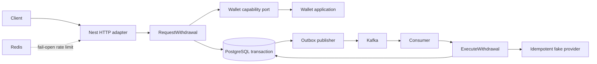

# Architecture

## Shape

The service is a modular monolith with three Nx libraries and one NestJS composition root. Wallet and Withdrawal are separate bounded contexts, as requested, but remain deployed together and use one PostgreSQL database so the request flow retains an ACID boundary.

Dependency direction is:

```text
domain <- application ports <- infrastructure adapters <- Nest composition
```

Withdrawal owns the consumer-facing `WalletReservationPort` and `WalletSettlementPort`. The application composition root adapts those narrow capabilities to Wallet application services. Withdrawal never imports Wallet repositories or aggregate internals.



## Transaction boundaries

`PostgresTransactionRunner` binds one `pg` client to an `AsyncLocalStorage` scope. Application code only sees `TransactionRunner`; infrastructure repositories obtain the active client and throw `MissingTransactionError` when mutation is attempted without it.

Request transaction:

1. Claim `(operation, idempotency_key)`.
2. Lock Wallet with `SELECT ... FOR UPDATE`.
3. Reserve funds and persist the reservation.
4. Insert Withdrawal.
5. Insert Outbox event.
6. Store the canonical response and commit.

Execution uses three phases: a short claim/PROCESSING transaction, the provider call outside PostgreSQL, and a short settlement transaction. The final transaction locks Withdrawal, finalizes or releases Wallet, and records the processed Kafka event atomically.

## Messaging and Redis

Outbox publishers lease rows using `FOR UPDATE SKIP LOCKED` and a 30-second lease. A crash after Kafka acknowledgement but before `published_at` creates a duplicate message; consumer idempotency is therefore mandatory.

Redis limits requests to 10 per user per minute. The adapter fails open. PostgreSQL remains the only authority for money and durable idempotency.

## Observability

Nest emits structured context for infrastructure failures. Correlation IDs are accepted from `x-correlation-id` or generated and returned. Operational logs should include `withdrawalId`, `userId`, `eventId`, operation, result, and error code without destination payloads or secrets.
