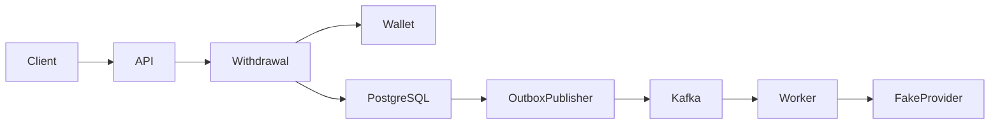

# Pooleno Senior Node.js Backend Challenge

## Wallet Withdrawal Processing

### Candidate Profile Alignment

This challenge is designed for a Senior Backend Engineer with practical experience in:

- Node.js
- TypeScript
- NestJS
- PostgreSQL
- Redis
- Kafka
- Microservices
- Wallet systems
- Cryptocurrency platforms

The purpose of the challenge is not to demonstrate a large number of technologies.

The focus is on:

- Domain-Driven Design
- backend design quality
- financial consistency
- concurrency
- idempotency
- asynchronous processing
- testing
- production-oriented thinking

The expected implementation time is approximately **10-12 hours**.

The solution should remain intentionally small.

## 1. Objective

Design and implement a simplified digital-asset withdrawal backend.

The implementation must demonstrate:

- Domain-Driven Design
- clear separation between Domain, Application, and Infrastructure layers
- correct wallet balance handling
- safe concurrent requests
- HTTP idempotency
- asynchronous processing using Kafka
- reliable event publishing using the Outbox Pattern
- PostgreSQL transaction design
- practical use of Redis
- unit and integration testing

Do not build a complete exchange platform.

## 2. Business Scenario

A user wants to withdraw a digital asset from their Pooleno wallet.

Example:

> Withdraw 100 USDT to an external wallet address.

The simplified flow is:

1. The client submits a withdrawal request.
2. The system validates the request.
3. The required amount is reserved from the wallet.
4. A Withdrawal is created.
5. A withdrawal execution event is persisted.
6. The event is asynchronously published to Kafka.
7. A worker consumes the event.
8. A fake external provider simulates withdrawal execution.
9. The withdrawal either succeeds or fails.
10. On success, the reserved amount is finalized.
11. On failure, the reservation is released.

Repeated HTTP requests or repeated Kafka messages must not create duplicate withdrawals or duplicate balance changes.

## 3. Required Scope

Implement only the following capabilities.

### 3.1 Create Withdrawal

**Endpoint**

```http
POST /withdrawals
```

Required header:

```http
Idempotency-Key: 5b44de87-cd75-475f-9cb9-09533dd55971
```

Example request:

```json
{
  "userId": "user-123",
  "asset": "USDT",
  "amount": "100",
  "destinationAddress": "TXYZ..."
}
```

Example response:

```json
{
  "withdrawalId": "withdrawal-001",
  "status": "PENDING",
  "asset": "USDT",
  "amount": "100"
}
```

Creating a withdrawal must:

- validate the amount,
- validate available wallet balance,
- atomically reserve funds,
- create the Withdrawal,
- persist an Outbox event,
- prevent duplicate requests using the same Idempotency-Key.

These operations must happen in one PostgreSQL transaction where applicable.

### 3.2 Execute Withdrawal

After the transaction commits, an Outbox Publisher publishes:

```json
{
  "eventId": "event-001",
  "eventType": "WithdrawalExecutionRequested",
  "withdrawalId": "withdrawal-001",
  "userId": "user-123",
  "asset": "USDT",
  "amount": "100",
  "occurredAt": "2026-08-15T10:00:00Z"
}
```

A Kafka consumer processes the event.

The consumer calls a fake provider.

The provider supports only two outcomes:

**Success**

```json
{
  "status": "SUCCESS",
  "transactionReference": "tx-001"
}
```

**Failure**

```json
{
  "status": "FAILED",
  "reason": "PROVIDER_ERROR"
}
```

No real blockchain integration is required.

### 3.3 Query Withdrawal

**Endpoint**

```http
GET /withdrawals/{withdrawalId}
```

Example response:

```json
{
  "withdrawalId": "withdrawal-001",
  "status": "COMPLETED",
  "asset": "USDT",
  "amount": "100",
  "transactionReference": "tx-001",
  "createdAt": "2026-08-15T10:00:00Z"
}
```

## 4. Domain-Driven Design Requirements

The solution must follow Domain-Driven Design principles.

A suggested domain model may contain:

- WalletAccount
- Withdrawal
- Money
- Asset
- WithdrawalAddress
- Reservation
- WithdrawalStatus

The candidate may define a different model if the reasoning is clear.

### 4.1 Suggested Modules

The solution should preferably be implemented as a Modular Monolith.

**Wallet Module**

Responsibilities:

- wallet balance
- available balance
- reservations
- reservation release
- final debit

**Withdrawal Module**

Responsibilities:

- withdrawal creation
- withdrawal lifecycle
- execution result
- state transitions

These modules should communicate through explicit application/domain boundaries.

Microservices are not required.

### 4.2 Layering

Suggested structure:

```text
src/
  modules/
    wallet/
      domain/
      application/
      infrastructure/

    withdrawal/
      domain/
      application/
      infrastructure/
      presentation/

  shared/
    domain/
    infrastructure/
```

The Domain Layer must not depend on:

- NestJS
- PostgreSQL
- Redis
- Kafka
- ORM-specific classes
- HTTP

Business rules should not exist only inside controllers or application services.

## 5. Required Business Invariants

The domain must enforce at least:

1. Withdrawal amount must be greater than zero.
2. Available wallet balance must never become negative.
3. Reserved balance must never exceed total balance.
4. The same withdrawal request must not reserve funds twice.
5. The same Idempotency-Key must not create multiple withdrawals.
6. The same Kafka event must not settle the withdrawal twice.
7. A completed withdrawal cannot return to a previous state.
8. A failed withdrawal must release its reservation.
9. Monetary calculations must not use JavaScript floating-point arithmetic.

Use:

- Decimal,
- integer minor units,
- or another explicitly justified approach.

## 6. Wallet Concurrency Requirement

The implementation must demonstrate correct handling of concurrent requests.

Example initial state:

```text
Wallet balance: 100 USDT
Available: 100 USDT
Reserved: 0 USDT
```

Two requests arrive simultaneously:

```text
Request A: withdraw 80 USDT
Request B: withdraw 80 USDT
```

Expected result:

```text
One request succeeds.
One request fails.
```

The wallet must never reach:

```text
Reserved = 160 USDT
```

The solution may use:

- PostgreSQL row-level locking
- optimistic concurrency
- conditional UPDATE
- Serializable transaction

The candidate must explain the selected strategy.

An in-memory lock is not acceptable.

Redis must not be the only mechanism protecting wallet financial consistency.

## 7. PostgreSQL Requirements

PostgreSQL must be the main source of truth.

The candidate must use database transactions correctly.

At minimum, the database should persist:

- Wallet
- Withdrawal
- Idempotency Record
- Outbox Event
- Processed Kafka Event

The candidate should define appropriate:

- primary keys
- unique constraints
- indexes
- transaction boundaries

## 8. Redis Requirement

Redis must be used, but its role should remain limited.

Choose one practical use case, for example:

**Option A - Idempotency Cache**

Cache completed Idempotency-Key results for faster repeated responses.

PostgreSQL must still provide the durable idempotency guarantee.

**Option B - Rate Limiting**

Use Redis to limit withdrawal request frequency per user.

**Option C - Short-lived Request Coordination**

Use Redis for temporary coordination, while PostgreSQL remains responsible for financial correctness.

The candidate should explain:

- why Redis was used,
- what happens if Redis becomes unavailable,
- why financial correctness does not depend solely on Redis.

## 9. HTTP Idempotency

The following request may be sent multiple times:

```http
POST /withdrawals
Idempotency-Key: key-123
```

It must produce the same logical result.

It must not:

- reserve funds twice,
- create two Withdrawals,
- create multiple execution events.

The candidate must explain:

- where the idempotency record is stored,
- whether request payload fingerprinting is used,
- what happens if the same key is used with a different payload,
- how simultaneous requests with the same key are handled.

## 10. Kafka Requirement

Kafka must be the only Message Broker used.

Assume at-least-once delivery.

Therefore:

```text
WithdrawalExecutionRequested
```

may arrive more than once.

The consumer must be idempotent.

A duplicate Kafka event must not:

- call financial settlement twice,
- debit the wallet twice,
- change a completed Withdrawal again.

The candidate may implement this using:

- ProcessedEvent table
- Inbox Pattern
- unique event ID
- database constraints

## 11. Outbox Pattern

Creating the withdrawal must persist both:

- business state,
- integration event,

within the same PostgreSQL transaction.

Conceptually:

```text
POST /withdrawals
        |
        +--> Reserve Wallet
        |
        +--> Create Withdrawal
        |
        +--> Create Outbox Event
        |
        +--> Commit
```

A background publisher reads pending Outbox records and publishes them to Kafka.

The publisher must:

- retry publication failures,
- mark successful publication,
- avoid silently losing events.

The candidate should explain why duplicate Kafka messages may still occur.

## 12. Withdrawal State Model

The candidate must explicitly model the Withdrawal lifecycle.

Suggested states:

```text
PENDING
FUNDS_RESERVED
PROCESSING
COMPLETED
FAILED
```

A different state model is acceptable.

Valid transitions may include:

```text
PENDING
  |
  v
FUNDS_RESERVED
  |
  v
PROCESSING
  |
  v
COMPLETED
```

or:

```text
PROCESSING
  |
  v
FAILED
```

Invalid transitions must be rejected.

For example:

```text
COMPLETED -> PROCESSING
```

must not be allowed.

## 13. Fake External Provider

Implement a simple interface:

```typescript
interface WithdrawalProvider {
  execute(
    command: ExecuteWithdrawalCommand
  ): Promise<ExecutionResult>;
}
```

The fake implementation only needs to support:

```text
SUCCESS
FAILED
```

A configurable delay or failure percentage is acceptable.

Do not implement:

- blockchain interaction
- wallet nodes
- smart contracts
- external APIs

## 14. Testing Requirements

### Domain Unit Tests

At minimum:

- invalid amount
- insufficient balance
- successful reservation
- reservation release
- invalid Withdrawal state transition
- duplicate completion prevention

### Integration Tests

At minimum:

- withdrawal creation
- wallet reservation
- Outbox record creation
- duplicate Idempotency-Key
- Kafka consumer idempotency
- failed withdrawal releases reservation
- successful withdrawal finalizes reservation

### Required Concurrency Test

Run two simultaneous withdrawal requests against the same wallet:

```text
Balance = 100 USDT
Request A = 80
Request B = 80
```

The test must prove only one succeeds.

## 15. Observability

Implement structured logging.

Useful fields:

```text
correlationId
withdrawalId
userId
eventId
operation
result
errorCode
```

Do not log:

- tokens
- passwords
- secrets
- complete sensitive payloads

Optional metrics:

```text
withdrawal_created_total
withdrawal_completed_total
withdrawal_failed_total
wallet_reservation_failed_total
outbox_pending_count
kafka_processing_failed_total
```

Prometheus implementation is optional.

Documentation of the metrics is sufficient.

## 16. AI-Assisted Development

AI usage is encouraged.

The candidate should provide a small:

```text
ai/
  AI_USAGE.md
  prompts/
```

At least three prompts should be included.

### Prompt 1 - Domain Design

Ask AI to review:

- aggregates
- entities
- value objects
- invariants
- module boundaries

### Prompt 2 - Concurrency Review

Ask AI to identify:

- race conditions
- wallet overspending risks
- transaction boundary problems
- idempotency issues

### Prompt 3 - Test Review

Ask AI to:

- identify missing test cases
- challenge happy-path-only testing
- review concurrency tests
- review duplicate message handling

`AI_USAGE.md` should briefly explain:

- which AI tool was used,
- where AI helped,
- one suggestion that was accepted,
- one suggestion that was rejected or modified,
- how generated code/design was verified.

No extensive prompt-engineering documentation is required.

## 17. Architecture Documentation

Create:

```text
docs/
  ARCHITECTURE.md
  DOMAIN_MODEL.md
  DECISIONS.md
```

### ARCHITECTURE.md

Describe:

- modules
- dependency direction
- PostgreSQL transaction boundaries
- Kafka flow
- Outbox flow
- Redis usage

### DOMAIN_MODEL.md

Describe:

- aggregates
- entities
- value objects
- invariants
- state transitions

### DECISIONS.md

Document at least three decisions:

1. Wallet concurrency strategy
2. Idempotency strategy
3. Why the solution uses a Modular Monolith

## 18. Required Diagram

Only one Mermaid diagram is required.

Example:



The candidate may provide additional diagrams if useful.

## 19. Deliverables

Repository:

```text
README.md
docker-compose.yml
.env.example
src/
test/
docs/
ai/
```

Docker Compose should contain only the required infrastructure:

```text
Application
PostgreSQL
Redis
Kafka
```

No additional infrastructure is expected.

README must explain:

- how to run the application,
- how to run tests,
- API examples,
- architecture summary,
- assumptions,
- known limitations,
- actual time spent.

## 20. Out of Scope

Do not implement:

- RabbitMQ
- MongoDB
- Elasticsearch
- blockchain integration
- ZK proofs
- smart contracts
- authentication server
- KYC
- frontend
- admin panel
- Kubernetes
- event sourcing
- complex reconciliation
- external crypto exchange integration
- complex fee engine
- multi-provider routing

The goal is **depth and correctness**, not infrastructure variety.

## 21. Evaluation Criteria

| Area | Weight |
| --- | ---: |
| Domain-Driven Design | 20% |
| Wallet correctness and concurrency | 20% |
| PostgreSQL transaction design | 15% |
| Idempotency | 15% |
| Kafka and Outbox | 10% |
| Node.js / NestJS quality | 10% |
| Testing | 5% |
| Redis usage | 2% |
| Documentation and AI usage | 3% |

## 22. Excellent Submission

An excellent submission demonstrates:

- real DDD rather than folder naming,
- rich domain behaviour,
- clear aggregate boundaries,
- safe monetary representation,
- PostgreSQL-level wallet correctness,
- tested concurrency behaviour,
- durable HTTP idempotency,
- idempotent Kafka consumer,
- correctly implemented Outbox,
- clean NestJS/domain separation,
- meaningful tests,
- clear engineering trade-offs.

## 23. Weak Submission

A weak submission demonstrates:

- CRUD services called DDD,
- business logic concentrated in NestJS Services,
- floating-point money calculations,
- wallet check using simple read-then-update,
- Redis used as the only wallet lock,
- duplicate HTTP requests create multiple Withdrawals,
- Kafka duplicate message changes the balance twice,
- direct PostgreSQL + Kafka dual write,
- no concurrency test,
- domain classes coupled to ORM or NestJS.

## 24. Interview Follow-Up Questions

After submission, ask:

1. What is the Aggregate Root in your Wallet module?
2. Why did you separate Wallet and Withdrawal?
3. Where exactly is the non-negative balance invariant protected?
4. What happens when two withdrawals arrive concurrently?
5. Why did you choose your PostgreSQL locking/concurrency strategy?
6. What happens if Redis becomes unavailable?
7. Why isn't Redis responsible for financial consistency?
8. What happens if PostgreSQL commits but Kafka is unavailable?
9. Why can the Outbox Publisher publish the same event twice?
10. How does your Kafka consumer handle duplicate delivery?
11. What happens if the same Idempotency-Key is sent concurrently?
12. What happens if the same Idempotency-Key is reused with another amount?
13. Why did you choose a Modular Monolith?
14. Which domain rules are enforced inside aggregates rather than application services?
15. What would you change before deploying this service to Pooleno production?

## Final Challenge Statement

Build a small but production-conscious digital-asset withdrawal workflow using:

- Node.js
- TypeScript
- NestJS
- PostgreSQL
- Redis
- Kafka

Use Domain-Driven Design and preferably a Modular Monolith.

Focus on:

- domain modelling,
- wallet correctness,
- concurrency,
- idempotency,
- PostgreSQL transactions,
- reliable Kafka event delivery,
- Outbox Pattern,
- testing.

Do not introduce additional infrastructure unless strictly necessary.

The objective is to demonstrate strong Senior Backend engineering through a small, correct, understandable solution, not through technology breadth.
